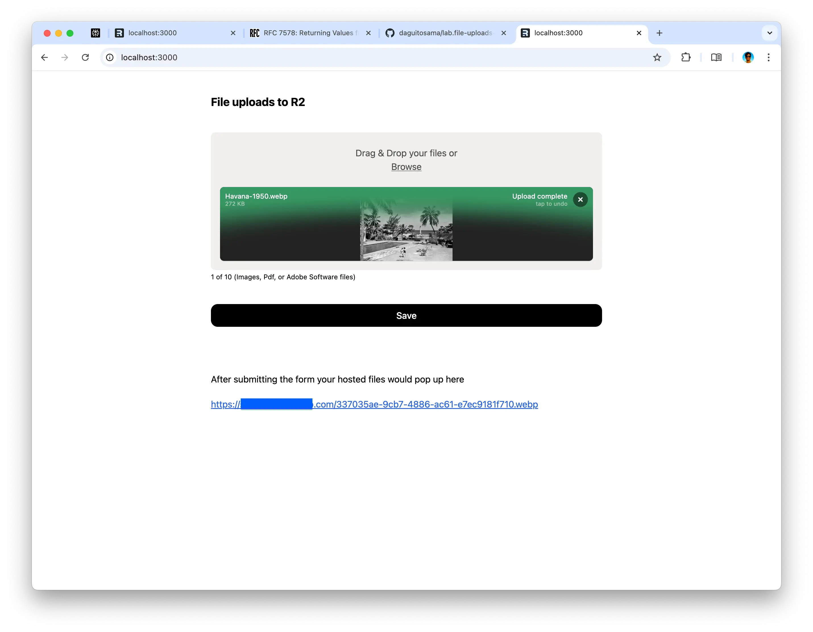

# File uploads to R2 experiment.

An example of File Upload feature implemented with

-   Remix,
-   Web Standard APIs,
-   McJackson APIs,
-   Nodejs APIs,
-   S3 APIs,
-   and a really cool client side lib: FilePond.

It works with and without JS on the browser.

This is an experiment I did while working on a private project, implementing a file upload feature for an e-commerce site, to allow customers provide design files to customize their product order. Specifically to learn:

-   How HTTP file uploads works
-   What is a multipart actually
-   How to handle them on a server environment
    -   aka : keep `await request.formData()` await of your file uploads handling code, since that keep the full response body on memory, and you have to keep your server alive and responsive right.
-   Extra logic rules like:
    -   validating and accepting only images, pdf, and adobe software documents
    -   max size (all though this probably would end up on a proxy server config instead my Remix code)
    -   handling temp files on the server, to keep incoming/outgoing streams out of memory as much as posible
-   How to store uploaded files to Cloudflare R2
-   How to serve them (you put a subdomain in front of the bucket and chill, it's a public use case after all, keep that presigned urls nonsense for another day)

## Notes

I did a deep dive on how multipart-data works:

-   One of, if not the first time I read with great joy one of those old fashion RFCs: [Returning Values from Forms: multipart/form-data](https://www.rfc-editor.org/rfc/rfc7578)
-   Learn about [netcat](https://stackoverflow.com/questions/8659808/how-does-http-file-upload-work#answer-26791188) and saw for real, what a form spits out over the wire using this truly awesome unix utility.

## How to run

-   get your self an R2 bucket, make it public by putting a custom domain on it
-   get those .evn.sample vars populated from one of your R2 buckets on an .env file
-   install deps with your favorite node package manager
-   start dev server, pnpm dev or the like
-   open your browser on localhost:3000, now you have 2 avenues
    -   default: rich client js upload feature, with image preview, file size validation and stuff (FilePond based)
    -   extra: HTML only feature for handling the uploads with plain HTML forms, you can see it by disabling JS

## Tasty treat

-   Tried out the `rollup-plugin-visualizer` for understating better my bundles
